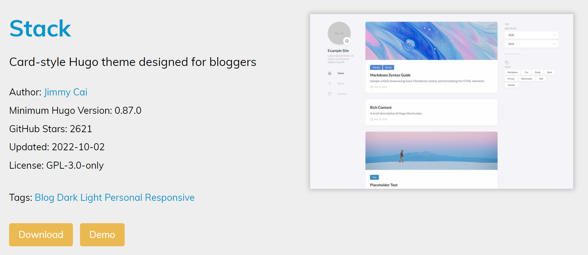
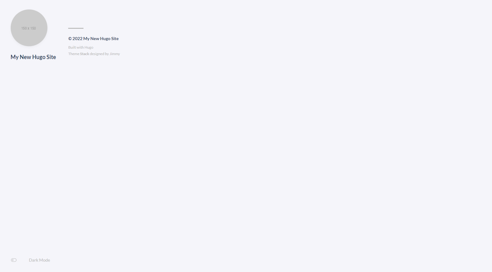
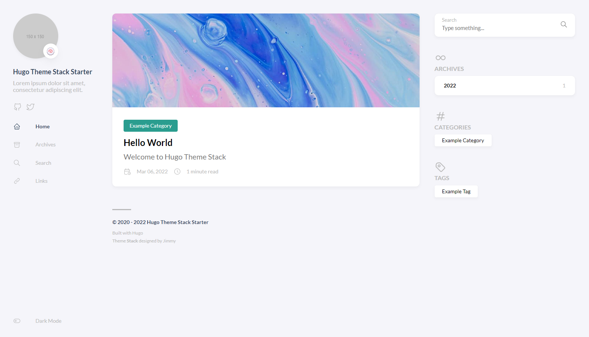
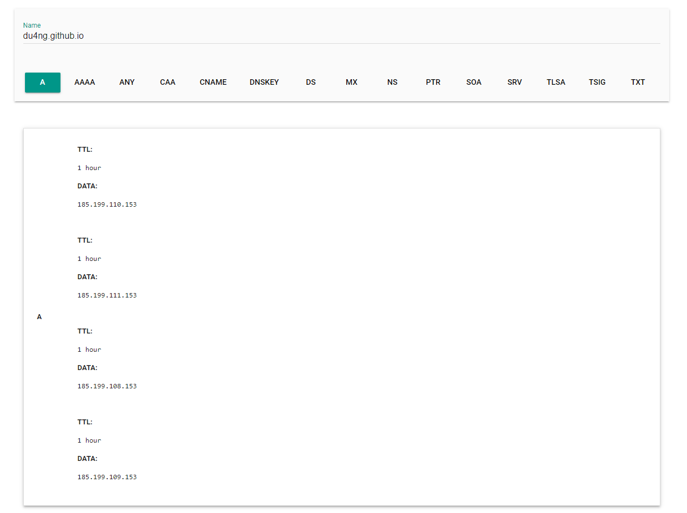
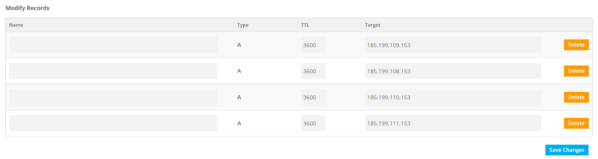
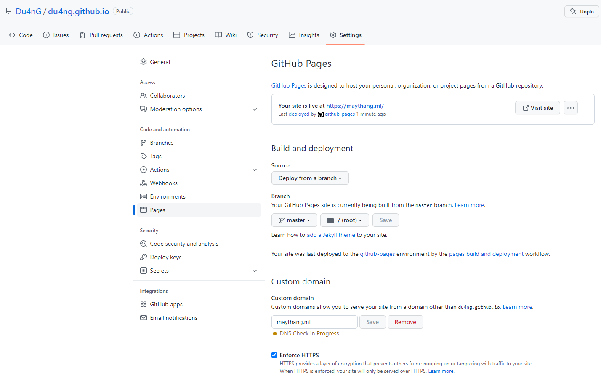

Dành cho những ai không có kiến thức về web, trong đó có cả mình 🙄. 
\
\
\
\
\
\
\
​

<!--more-->
##  1. GIỚI THIỆU

Một ngày đẹp trời, mình tình cờ vấp phải [**That IELTS Guide 🌱**](https://thatieltsguide.com/) của thầy Quang, một con web được thầy build phục vụ cho mục đích dạy tiếng Anh, làm mình nhớ lại quả ai-eo.com của thầy khoảng ba năm trước, giờ thì chắc nó hẹo rồi.
\
\
Vì vậy hôm nay, mình quyết định all-in dogecoin, à nhầm, quyết định chia sẻ cho mọi người cách tạo một trang web cực kỳ đơn giản, chỉ cần một chút kiến thức về code là được.
\
\
Tất nhiên chúng ta không build-from-scratch mà sẽ sử dụng những template có sẵn. Trong bài viết này, mình sẽ sử dụng framework Hugo. 
\
\
\
\
\
\
\
​
## 2. CÀI ĐẶT
Trước tiên, tải bản release mới nhất của Hugo tại [**:(far fa-file-archive fa-fw):đây**](https://github.com/gohugoio/hugo/releases/).
\
\
Sau khi giải nén, bạn sẽ nhận được một file hugo.exe. Thêm đường dẫn chứa file này vào PATH environment variables nhé.
\
\
Thêm như nào á ? Lên mạng mà coi. Sau khi thêm xong, hãy check thử version của Hugo khi `cd` tại bất kỳ đâu trong terminal :
```bash
>>> hugo version
```
\
Nếu check thành công, vào việc.
\
\
\
​
### 2.1 Tạo Project
Mở VS Code, chúng ta sẽ tạo ra một folder qua lệnh dưới đây. Mình sẽ gọi nó là root folder (folder gốc) :
```bash
>>> hugo new site tên_muốn_đặt_cho_root_folder
```
\
Bên trong, một vài folder rỗng đồng thời cũng được tạo ra, ta sẽ lấp đầy chúng trong chốt lát thôi.
\
\
\
​
### 2.2 Chọn Theme

Đi chợ thôi, cứ việc chọn cho mình một theme tuỳ thích tại chợ [**Kim Biên**](https://themes.gohugo.io/) nè.
\
\
Chẳng hạn, mình chọn theme Stack, các bạn có thể tham khảo theme này tại [**Sound Engineering**](https://kpnn.ml/) của Tank nhé.
\
\

Các bạn có thể nhấn vào **Demo** để xem thử theme, nếu ưng ý, chạy lệnh git sau tại root folder :

```bash
>>> cd themes
>>> git clone https://github.com/CaiJimmy/hugo-theme-stack.git

    git clone https://github.com/url_của_theme_trên_github.git  
```

\
Trường hợp xấu hơn, nếu mọi người không thể clone về được (như mình chẳng hạn 😶 do proxy công ty), hoặc thậm chí nếu bạn còn đéo biết dùng git, chỉ việc tải trực tiếp folder zip của theme đó qua nút **Download** trong hình.
\
\
Ai rồi cũng phải git thôi.
\
\
\
​
### 2.3 Cấu trúc cơ bản của một Theme {#basic-configuration}

Một theme (chủ đề), bao gồm nhiều thứ như tone màu chủ đạo, menu, font chữ, bo góc,... đồng điệu với nhau.  
\
Bạn sẽ chú ý đến một file gọi là file ⚙️config. Đây sẽ là file dùng để chỉnh sửa nhanh những gì nổi bật nhất của một theme.
\
\

File config tồn tại dưới 3 đuôi khác nhau gồm `.toml`, `.yaml` hoặc `.json` tuỳ vào sở thích của thằng cha tác giả, nhưng chung quy lại chúng chỉ khác nhau về cú pháp mà thôi.

\
Dưới đây là cấu trúc cơ bản của file config.toml bên trong folder **📁exampleSite** (*đã được mình lược bớt*). Tuỳ vào nhu cầu hiển thị của bạn nên cứ vọc vạch đi nhá.


```toml
baseURL = "https://example.org/"

# Tên theme mà không giống folder theme thì nó không tìm được đâu
theme = "tên_folder_theme"

# Tiêu đề website
title = "Dũng đẹp trai vãi cả l"

# Ngôn ngữ ["en", "vi", "fr", "pl", ...]
languageCode = "en"
# Tên cúng cơm của ngôn ngữ ["English", "Vietlam", "Français", "Polski", ...]
languageName = "English"

# Thông tin thằng tác giả
[author]
  name = "tên"
  email = "meo"
  link = "linh"

# Menu, giống như phần ảnh, video, bạn bè trên facebook ấy
[menu]
  [[menu.main]]
    weight = 1
    identifier = "posts"
    pre = ""
    post = ""
    name = "📜Bài viết" # hover vào name sẽ thấy title
    url = "/posts/"
    title = "Dũng"
  [[menu.main]]
    weight = 2
    identifier = "tags"
    pre = ""
    post = ""
    name = "🏷️Thẻ"
    url = "/tags/"
    title = "đẹp"
  [[menu.main]]
    weight = 3
    identifier = "categories"
    pre = ""
    post = ""
    name = "📁Mục"
    url = "/categories/"
    title = "trai"
```
\
\
\
​
### 2.4 Khởi chạy trên local
Ban nãy, khi bạn tạo ra các folder rỗng bên trong root folder, một file config cũng được tạo ra, nhớ thêm vào file này dòng `theme = 'tên_folder_theme'` nhé. Sau đó :
```cmd
>>> hugo server
```
\
\
Truy cập vào `localhost:1313`.
\
\
Gòi, coi thử mặt mũi nó như nào.

\
\
Để xem thử một website hoàn chỉnh, chúng ta sẽ ghé sang  **📁exampleSite** (một subfoler bên trong theme các bạn vừa clone về), chính là trang web mà mọi người thấy khi nhấn vào nút **Demo** ban nãy. Thử lại phát nào :
```bash
>>> cd themes\tên_theme\exampleSite
>>> hugo server
```
\
Và..
​





Thông thường, với mỗi file `index.ngôn_ngữ.md` bên trong thư mục posts (tượng trưng cho từng bài viết trên web), sẽ có một dòng lệnh như thế này `draft: false`. Nếu giá trị của nó là `true`, nghĩa là post đó đang được lưu ở dạng nháp, nó sẽ không hiện lên web.

\
Do đó, nếu cảm thấy một vài post sủi mất, ta có thể nắm đầu chúng bằng cách gõ lệnh dưới đây :
```bash
hugo server -D
```
\
Tuy vậy, nếu muốn chúng luôn luôn xuất hiện sau khi đã deploy trang web hẳn hoi, nhớ vào code sửa lại thành `false` cho chắc kèo nhé.

Bật 💾Auto Save để code tới đâu website sẽ refresh tới đó.

\
\
​
**Đến đây thì các bạn đã tự mình ăn cắp, ý mình là, mượn thành công ý tưởng của một thằng nào đấy trên mạng. 
Đến lúc biến nó thành của riêng mình rồi. 👀**
\
\
\
\
\
\
\
​
## 3. TUỲ CHỈNH
### 3.1 Viết Blog thôi nào !
Trông thì cũng đẹp đấy, nhưng nếu chúng ta muốn viết content cho riêng mình thì phải làm thế nào ? Hiện tại ta đang ở **📁exampleSite**, quay về root folder bằng cách `cd` lùi lại 3 folder :
```bash
>>> cd ../../../
```
\
\
Chui vào **📁content**, tạo vài subfolder và một file markdown :
```bash
>>> cd content
>>> mkdir posts
>>> mkdir tên_blog_muốn_đặt
>>> hugo new tên_file_markdown_muốn_đặt.md
```
\
\
\
\
\
\
\
Ơ mà khoan, markdown là gì cơ ?
\
\
\
\
\
\
\
​
### 3.2 Markdown

Ví dụ, mình mở một file .md bất kỳ theo đường dẫn dưới đây :
>**📁exampleSite**>**📁content**>**📁posts**>**📁tên_folder_bài_viết**>`:(fab fa-js fa-markdown):index.ngôn_ngữ.md`
```markdown
---
weight: 1
# title: "[HUGO] - Mình Đã Tự Tạo Một Trang Web Như Thế Nào"
title: "[HUGO] - Mình Có Một Thằng Mentor Hay Trốn Việc"

date: 2022-10-12T22:29:01+08:00
lastmod: 2022-15-06T21:29:01+08:00
draft: false
author: " Dũng Học Giỏi"
authorLink: "https://www.facebook.com/queo.stn/"
description: "Bấm vô nhanh cmm lên !"

images: []
resources:
- name: "featured-image"
  src: "featured-image.png"

tags: ["web", "tìu tô ri ồ]
categories: ["tài liệu"]

lightgallery: true

toc:
  auto: false
---

Bên trên là phần tiêu đề, để viết nội dung thì chỉ cần tiếp tục viết thôi.
Blah...blah..NỘI DUNG...blah..blah...

```
\
Đây chính là file chứa toàn bộ nội dung của một bài viết. Mỗi khi nhấn vào một bài viết bất kỳ trên [**Dũng Học Giỏi**](https://maythang.ml), tất cả content mà bạn đọc được khi lăn chuột, đều được mình thủ công viết dưới dạng :(fab fa-js fa-markdown): markdown, bao gồm cả table, hiệu ứng in đậm in nghiêng, các đề mục và cả đường link. 
\
\
\
​
### 3.3 Custom theme
Nếu bạn muốn trùng tu cho trang web của mình, bạn sẽ cần đến một chút kiến thức về `css`(`scss`) đấy nhé 🤓.
Bên trong folder **📁themes** sẽ chứa một số subfolder quan trọng như :

|Folder      | Chứa các file       |
| ---------- | -----------         |
| assets     |:(fab fa-css3):   CSS|
|            |­­­:(fab fa-sass): SCSS |
|            |­:(fab fa-js):      JS|
| layouts    |:(fab fa-html5): HTML|
| static     | font chữ            |
| i18n       | ngôn ngữ            |

\
\
\
​
### 3.4 Vòng quanh trái đất {#language-compatibility}
Thông thường, các mục của một trang web có thể thay đổi được ngôn ngữ, riêng content thì hên xui tuỳ thằng làm web có đủ kiên nhẫn dịch tay hay không.
\
\
Điều này có thể thực hiện bằng cách sử dụng các file `"ngôn_ngữ".toml` bên trong folder **i18n**.
\
\
\
\
\
\
\
​
## 4. LÊN DĨA
Sau khi ăn trộm và đạo nhái các kiểu, chúng ta sẽ đưa web lên server nhé.
​\
​
### 4.1 Đưa web lên server

Chúng ta sẽ cần một server để host trang web. Có khá nhiều lựa chọn như GitHub, GitLab, Netlify, Firebase,... Mình hay xem mèo đen nên đành chọn :(fab fa-github): GitHub vậy.
\
\
GitHub cung cấp một tên miền miễn phí đối với mỗi user như sau :`tên_user.github.io`. Ta sẽ tạo một repo mới trên GitHub, đặt tên giống với tên miền trên. Ví dụ như [du4ng.github.io](https://github.com/Du4nG/du4ng.github.io).
\
\
​Tại root folder, gõ :
```bash
>>> hugo
```
\
Folder **📁public** sẽ được tạo ra, đây sẽ là nơi chứa toàn bộ những gì sẽ hiển thị trên server, được generate từ một số folder nhất định. Vì vậy, cấu trúc file sẽ khá khác với cấu trúc trên local.
\
\
Bước cuối cùng của công đoạn tiễn web lên thiên đàng, chúng ta sẽ push mọi thứ bên trong folder này lên trên repo vừa tạo.  

```bash
>>> cd public
>>> git init
>>> git remote add origin https://github.com/tên_user/tên_user.github.io.git
>>> git add .
>>> git commit -m "lên_thiên_đàng"
>>> git push origin master
```
\
Tất cả file bên trong **📁public** lúc này đã được đẩy lên repo. Chờ vài phút, trang web của các bạn sẽ xuất hiện khi ta nhập `tên_user.github.io` vào thanh URL trên trình duyệt.


\
\
​
### 4.2 Thay hình đổi dạng
NHƯNG, dùng tên miền như vậy sẽ bị người khác đánh giá đấy. Hay ta thử thay tên đổi họ xem sao. Có rất nhiều đơn vị cung cấp tên miền uy tín như Namecheap, GoDaddy, BlueHost,... Các bạn có thể tham khảo các đuôi phổ biến sau :
|Trả phí   | Đồ chùa      |
| -------- | -----------  |
| .com .dev. org .edu .vn .net |.tk .cf .gq .ga|

\
Vì nhà mình nghèo, nên mình sẽ nhờ **Freenom** làm giả hộ chiếu. Chi tiết cách để tậu cho mình một tên miền qua Freenom, các bạn có thể tra Google vì mình gõ cũng hơi mỏi tay rồi.
\
\
\
\
​
Phew, tiếp tục thôi.
\
\
\
\
​
Lấy ví dụ về tên miền mà GitHub bố thí cho mình, ta thử truy vấn đến `du4ng.github.io` qua  [**DNS lookup**](https://toolbox.googleapps.com/apps/dig) của Google. Kết quả trả về như sau :


\
Kết quả nhận được  là một bản ghi A (A Record) bao gồm bốn địa chỉ IP. Các địa chỉ này chính là IP của GitHub Pages, nơi mà trang web của các bạn đang được host. Mỗi lần các bạn gõ `tên_user.github.io` vào thanh URL của trình duyệt, tên miền này sẽ được phân giải thành một trong bốn IP trên, trỏ đến GitHub Pages của các bạn.

\
\
Chúng ta sẽ làm một động tác, tương tự như nguyên lý ban nãy, dùng custom domain để trỏ đến bốn địa chỉ IP. Ta sẽ modify tên miền trên Freenom, tiến hành nhập bốn địa chỉ vào bốn dòng tương ứng tại cột Target :

**185.199.108.153
\
185.199.109.153
\
185.199.110.153
\
185.199.111.153**


\
\
Tại repo, mò vào **⚙️Settings**, nhấn vào **Pages** :


Sau khi nhấn Save, một file CNAME sẽ được tạo ngay trong repo, với nội dung chỉ vọn vẻn là tên miền custom.
\
\
Tại ô **Enforce HTTPS** (khoảng 24h sau mới tích được) nên cứ chờ đi nhé. Thông thường, các đơn vị cung cấp tên miền miễn phí chỉ hỗ trợ HTTP, nên nếu bạn truy cập web từ Facebook thì có thể bị còng đầu đấy (Facebook có filter cho insecure sites).
\
\
Và thế là hết !!!
\
\
\
\
\
\
​
## 5. KẾT
\
\
\
\
\
​
Tương truyền rằng, Nguyen Dang Quang còn học thêm thêm cả JavaScript, dùng GPT để lôi API về build thêm các site khác phục vụ cho mục đích dạy IELTS của thầy.

Chúc các bạn thành công trên con đường trộm cắp của mình.