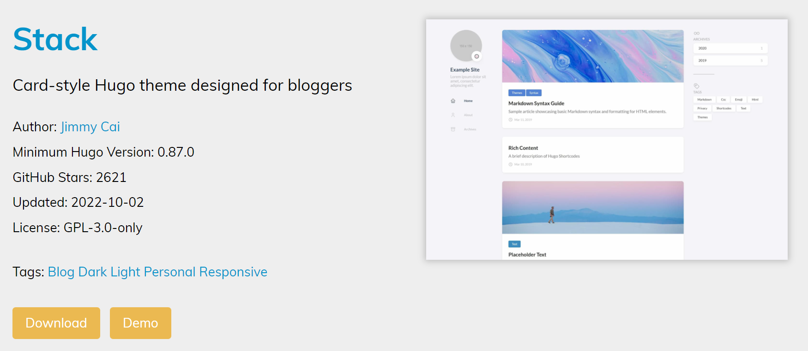
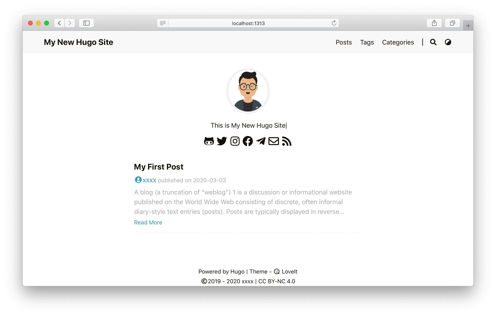
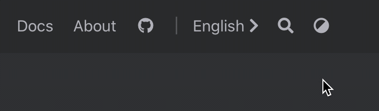

Dành cho những ai không có kiến thức về lập trình web, trong đó có cả mình 🙄.
\
\
\
\
\
​

<!--more-->
##  1. GIỚI THIỆU

Một ngày đẹp trời, mình tình cờ thấy một website được build bởi thầy Quang, phục vụ cho mục đích dạy tiếng Anh, làm mình nhớ lại con web ai-eo.com cũng của thầy khoảng 3 năm trước, giờ thì chắc nó hẹo rồi.
\
\
Vì vậy hôm nay, mình quyết định all-in dogecoin, à nhầm, quyết định chia sẻ cho mọi người cách tạo một trang web cực kỳ đơn giản, chỉ cần có chút kiến thức về cách thức mà code hoạt động, dù là ngôn ngữ nào đi chăng nữa.
\
\
Trong bài viết này, mình sẽ sử dụng [**Hugo**](https://gohugo.io/) và thao tác trên [**VSCode**](https://code.visualstudio.com/). Tất nhiên chúng ta không build-from-scratch mà sẽ sử dụng những template có sẵn.
\
\
Giờ thì 👓 vào việc.
\
\
\
\
\
​
## 2. CÀI ĐẶT

Trước tiên, tải bản release mới nhất của Hugo tại [**:(far fa-file-archive fa-fw):đây**](https://github.com/gohugoio/hugo/releases/).
\
\
Sau khi giải nén, bạn sẽ nhận được một file hugo.exe. Vì ta chỉ đang chạy trên local nên cần phải thêm đường dẫn chứa file .exe vào PATH environment variables nhé.
\
\
Thêm như nào á ? Lên mạng mà coi 😡. Nếu thành công thì bạn có thể check được version của Hugo khi cd tại bất kỳ đâu trong terminal.
\
\
\
​
### 2.1 Chọn Theme

Đi chợ thôi, cứ việc chọn cho mình một theme tuỳ thích tại chợ 👉[**Kim Biên**](https://themes.gohugo.io/) nè.
\
\
Ở đây, mình sẽ lấy theme Stack làm ví dụ, các bạn có thể tham khảo theme này tại [**Sound Engineering**](https://kpnn.ml/) của Tank nhé.
\
\

Các bạn có thể nhấn vào **Demo** để xem thử theme, nếu ưng ý, chạy lệnh git sau trong VSCode tại folder mà bạn muốn nhé.

```cmd
cd themes
git clone https://github.com/CaiJimmy/hugo-theme-stack.git

git clone https://github.com/tên_github_tác_giả/tên_theme/hugo-theme-stack.git
```

\
Trường hợp xấu hơn, nếu mọi người không thể clone về được (như mình chẳng hạn 😶 do proxy công ty), hoặc thậm chí nếu bạn còn đéo biết dùng git, chỉ việc tải trực tiếp folder zip của theme đó qua nút **Download** trong hình.
\
\
\
​
### 2.2 Cấu trúc cơ bản của một Theme {#basic-configuration}

Một theme (chủ đề), bao gồm nhiều thứ như tone màu chủ đạo, menu, font chữ, bo góc,.. đồng điệu với nhau.  
\
Bạn sẽ chú ý đến một file gọi là file ⚙️config. Đây sẽ là file dùng để chỉnh sửa nhanh những gì nổi bật nhất của một theme.
\
\

File config tồn tại dưới 3 đuôi khác nhau gồm `.toml`, `.yaml` hoặc `.json`. Tuỳ vào sở thích của thằng cha tác giả, nhưng chung quy lại chúng chỉ khác nhau về cú pháp mà thôi.

\
Dưới đây là cấu trúc cơ bản của file config.toml (*đã được mình lược bớt*) đối với một theme bất kỳ. Có đến hai file config, nhưng chủ yếu chúng ta chỉ cần thao tác trên file config bên trong **📁exampleSite** là đủ.


​ 👇 Tự xổ ra đi con đĩ.
```toml
baseURL = "http://example.org/"

# Tên theme ở đây phải giống với tên của root folder
theme = "tên_giống_với tên_root_folder"

# Tiêu đề website
title = "Dũng đẹp trai vãi cả l"

# Ngôn ngữ ["en", "zh-CN", "fr", "pl", ...]
languageCode = "en"
# Tên cúng cơm của ngôn ngữ ["English", "简体中文", "Français", "Polski", ...]
languageName = "English"

# Thông tin thằng tác giả
[author]
  name = "xxxx"
  email = ""
  link = ""

# Menu, giống như phần ảnh, video, bạn bè trên facebook ấy
[menu]
  [[menu.main]]
    weight = 1
    identifier = "posts"
    pre = ""
    post = ""
    name = "Posts"
    url = "/posts/"
    # Tiêu đề sẽ hiện lên khi hover vào url
    title = ""
  [[menu.main]]
    weight = 2
    identifier = "tags"
    pre = ""
    post = ""
    name = "Tags"
    url = "/tags/"
    title = ""
  [[menu.main]]
    weight = 3
    identifier = "categories"
    pre = ""
    post = ""
    name = "Categories"
    url = "/categories/"
    title = ""

# Markup related configuration in Hugo
[markup]
  # Syntax Highlighting (https://gohugo.io/content-management/syntax-highlighting)
  [markup.highlight]
    # false is a necessary configuration (https://github.com/dillonzq/LoveIt/issues/158)
    noClasses = false
```
​ 👆
\
​

Tên theme :`theme = "hugo-theme-stack"` bên trong file config phải đặt giống với tên của root folder `📁hugo-theme-stack`(cái folder gốc mà bạn trộm từ github về ấy).



\
\
\
​
### 2.3 Tạo Project

Giờ mới vào bài nè !
\
\
Trong bài viết này, mình sẽ hướng dẫn các bạn sử dụng **exampleSite** (một subfoler bên trong folder các bạn vừa clone về), chính là trang web mà mọi người thấy khi nhấn vào nút **Demo** ban nãy. 
\
\
\
​
Khởi chạy web trên local

Gòi, coi thử mặt mũi nó như nào.

```cmd
cd exampleSite
hugo server
```
\
\
Truy cập vào `http://localhost:1313`.



Thông thường, với mỗi file `index.ngôn_ngữ.md` bên trong thư mục posts (tượng trưng cho từng bài viết trên web), sẽ có một dòng lệnh như thế này `draft: false`. Nếu giá trị của nó là `true`, nghĩa là post đó đang được lưu ở dạng nháp, nó sẽ không hiện lên web.

\
Do đó, nếu cảm thấy một vài post sủi mất, ta có thể nắm đầu chúng bằng cách gõ lệnh dưới đây :
```cmd
hugo server -D
```
\
Tuy vậy, nếu muốn chúng luôn luôn xuất hiện sau khi đã deploy trang web hẳn hoi, nhớ vào code sửa lại thành `false` cho chắc kèo nhé.

Bật 💾Auto Save để code tới đâu website sẽ refresh tới đó.

\
\
​
**Đến đây thì các bạn đã tự mình ăn cắp, à không, mượn ý tưởng của một thằng nào đấy trên mạng. 
Đến lúc biến nó thành của riêng mình rồi 👀!**
\
\
\
​
## 3. TUỲ CHỈNH

### 3.1 Cấu hình website {#site-configuration}

In addition to [Hugo global configuration](https://gohugo.io/overview/configuration/) and [menu configuration](#basic-configuration), **LoveIt** lets you define the following parameters in your site configuration (here is a `config.toml`, whose values are default).

Please open the code block below to view the complete sample configuration :(far fa-hand-point-down fa-fw)::

```toml
baseURL = "http://example.org/"

# Change the default theme to be use when building the site with Hugo
theme = "LoveIt"

# website title
title = "My New Hugo Site"

# language code ["en", "zh-CN", "fr", "pl", ...]
languageCode = "en"
# language name ["English", "简体中文", "Français", "Polski", ...]
languageName = "English"
# whether to include Chinese/Japanese/Korean
hasCJKLanguage = false

# default amount of posts in each pages
paginate = 12
# google analytics code [UA-XXXXXXXX-X]
googleAnalytics = ""
# copyright description used only for seo schema
copyright = ""

# whether to use robots.txt
enableRobotsTXT = true
# whether to use git commit log
enableGitInfo = true
# whether to use emoji code
enableEmoji = true

# ignore some build errors
ignoreErrors = ["error-remote-getjson", "error-missing-instagram-accesstoken"]

# Author config
[author]
  name = "xxxx"
  email = ""
  link = ""

# Menu config
[menu]
  [[menu.main]]
    weight = 1
    identifier = "posts"
    # you can add extra information before the name (HTML format is supported), such as icons
    pre = ""
    # you can add extra information after the name (HTML format is supported), such as icons
    post = ""
    name = "Posts"
    url = "/posts/"
    # title will be shown when you hover on this menu link
    title = ""
  [[menu.main]]
    weight = 2
    identifier = "tags"
    pre = ""
    post = ""
    name = "Tags"
    url = "/tags/"
    title = ""
  [[menu.main]]
    weight = 3
    identifier = "categories"
    pre = ""
    post = ""
    name = "Categories"
    url = "/categories/"
    title = ""

[params]
  # site default theme ["auto", "light", "dark"]
  defaultTheme = "auto"
  # public git repo url only then enableGitInfo is true
  gitRepo = ""
  #  which hash function used for SRI, when empty, no SRI is used
  # ["sha256", "sha384", "sha512", "md5"]
  fingerprint = ""
  #  date format
  dateFormat = "2006-01-02"
  # website title for Open Graph and Twitter Cards
  title = "My cool site"
  # website description for RSS, SEO, Open Graph and Twitter Cards
  description = "This is my cool site"
  # website images for Open Graph and Twitter Cards
  images = ["/logo.png"]

  # Header config
  [params.header]
    # desktop header mode ["fixed", "normal", "auto"]
    desktopMode = "fixed"
    # mobile header mode ["fixed", "normal", "auto"]
    mobileMode = "auto"
    #  Header title config
    [params.header.title]
      # URL of the LOGO
      logo = ""
      # title name
      name = ""
      # you can add extra information before the name (HTML format is supported), such as icons
      pre = ""
      # you can add extra information after the name (HTML format is supported), such as icons
      post = ""
      #  whether to use typeit animation for title name
      typeit = false

  # Footer config
  [params.footer]
    enable = true
    #  Custom content (HTML format is supported)
    custom = ''
    #  whether to show Hugo and theme info
    hugo = true
    #  whether to show copyright info
    copyright = true
    #  whether to show the author
    author = true
    # Site creation time
    since = 2019
    # ICP info only in China (HTML format is supported)
    icp = ""
    # license info (HTML format is supported)
    license = '<a rel="license external nofollow noopener noreffer" href="https://creativecommons.org/licenses/by-nc/4.0/" target="_blank">CC BY-NC 4.0</a>'

  #  Section (all posts) page config
  [params.section]
    # special amount of posts in each section page
    paginate = 20
    # date format (month and day)
    dateFormat = "01-02"
    # amount of RSS pages
    rss = 10

  #  List (category or tag) page config
  [params.list]
    # special amount of posts in each list page
    paginate = 20
    # date format (month and day)
    dateFormat = "01-02"
    # amount of RSS pages
    rss = 10

  #  App icon config
  [params.app]
    # optional site title override for the app when added to an iOS home screen or Android launcher
    title = "My cool site"
    # whether to omit favicon resource links
    noFavicon = false
    # modern SVG favicon to use in place of older style .png and .ico files
    svgFavicon = ""
    # Android browser theme color
    themeColor = "#ffffff"
    # Safari mask icon color
    iconColor = "#5bbad5"
    # Windows v8-10 tile color
    tileColor = "#da532c"

  #  Search config
  [params.search]
    enable = true
    # type of search engine ["lunr", "algolia"]
    type = "lunr"
    # max index length of the chunked content
    contentLength = 4000
    # placeholder of the search bar
    placeholder = ""
    #  max number of results length
    maxResultLength = 10
    #  snippet length of the result
    snippetLength = 30
    #  HTML tag name of the highlight part in results
    highlightTag = "em"
    #  whether to use the absolute URL based on the baseURL in search index
    absoluteURL = false
    [params.search.algolia]
      index = ""
      appID = ""
      searchKey = ""

  # Home page config
  [params.home]
    #  amount of RSS pages
    rss = 10
    # Home page profile
    [params.home.profile]
      enable = true
      # Gravatar Email for preferred avatar in home page
      gravatarEmail = ""
      # URL of avatar shown in home page
      avatarURL = "/images/avatar.png"
      #  title shown in home page (HTML format is supported)
      title = ""
      # subtitle shown in home page (HTML format is supported)
      subtitle = "This is My New Hugo Site"
      # whether to use typeit animation for subtitle
      typeit = true
      # whether to show social links
      social = true
      #  disclaimer (HTML format is supported)
      disclaimer = ""
    # Home page posts
    [params.home.posts]
      enable = true
      # special amount of posts in each home posts page
      paginate = 6
      #  replaced with hiddenFromHomePage in params.page
      # default behavior when you don't set "hiddenFromHomePage" in front matter
      defaultHiddenFromHomePage = false

  # Social config about the author
  [params.social]
    GitHub = "xxxx"
    Linkedin = ""
    Twitter = "xxxx"
    Instagram = "xxxx"
    Facebook = "xxxx"
    Telegram = "xxxx"
    Medium = ""
    Gitlab = ""
    Youtubelegacy = ""
    Youtubecustom = ""
    Youtubechannel = ""
    Tumblr = ""
    Quora = ""
    Keybase = ""
    Pinterest = ""
    Reddit = ""
    Codepen = ""
    FreeCodeCamp = ""
    Bitbucket = ""
    Stackoverflow = ""
    Weibo = ""
    Odnoklassniki = ""
    VK = ""
    Flickr = ""
    Xing = ""
    Snapchat = ""
    Soundcloud = ""
    Spotify = ""
    Bandcamp = ""
    Paypal = ""
    Fivehundredpx = ""
    Mix = ""
    Goodreads = ""
    Lastfm = ""
    Foursquare = ""
    Hackernews = ""
    Kickstarter = ""
    Patreon = ""
    Steam = ""
    Twitch = ""
    Strava = ""
    Skype = ""
    Whatsapp = ""
    Zhihu = ""
    Douban = ""
    Angellist = ""
    Slidershare = ""
    Jsfiddle = ""
    Deviantart = ""
    Behance = ""
    Dribbble = ""
    Wordpress = ""
    Vine = ""
    Googlescholar = ""
    Researchgate = ""
    Mastodon = ""
    Thingiverse = ""
    Devto = ""
    Gitea = ""
    XMPP = ""
    Matrix = ""
    Bilibili = ""
    Discord = ""
    DiscordInvite = ""
    Lichess = ""
    ORCID = ""
    Pleroma = ""
    Kaggle = ""
    MediaWiki= ""
    Plume = ""
    HackTheBox = ""
    RootMe= ""
    Phone = ""
    Email = "xxxx@xxxx.com"
    RSS = true # 

  #  Page global config
  [params.page]
    #  whether to hide a page from home page
    hiddenFromHomePage = false
    #  whether to hide a page from search results
    hiddenFromSearch = false
    #  whether to enable twemoji
    twemoji = false
    # whether to enable lightgallery
    lightgallery = false
    #  whether to enable the ruby extended syntax
    ruby = true
    #  whether to enable the fraction extended syntax
    fraction = true
    #  whether to enable the fontawesome extended syntax
    fontawesome = true
    # whether to show link to Raw Markdown content of the content
    linkToMarkdown = true
    #  whether to show the full text content in RSS
    rssFullText = false
    #  Table of the contents config
    [params.page.toc]
      # whether to enable the table of the contents
      enable = true
      #  whether to keep the static table of the contents in front of the post
      keepStatic = true
      # whether to make the table of the contents in the sidebar automatically collapsed
      auto = true
    #   mathematical formulas
    [params.page.math]
      enable = true
      #  default inline delimiter is $ ... $ and \( ... \)
      inlineLeftDelimiter = ""
      inlineRightDelimiter = ""
      #  default block delimiter is $$ ... $$, \[ ... \], \begin{equation} ... \end{equation} and some other functions
      blockLeftDelimiter = ""
      blockRightDelimiter = ""
      # KaTeX extension copy_tex
      copyTex = true
      # KaTeX extension mhchem
      mhchem = true
    #  Code config
    [params.page.code]
      # whether to show the copy button of the code block
      copy = true
      # the maximum number of lines of displayed code by default
      maxShownLines = 50
    #   config
    [params.page.mapbox]
      # access token of Mapbox GL JS
      accessToken = ""
      # style for the light theme
      lightStyle = "mapbox://styles/mapbox/light-v10?optimize=true"
      # style for the dark theme
      darkStyle = "mapbox://styles/mapbox/dark-v10?optimize=true"
      # whether to add 
      navigation = true
      # whether to add 
      geolocate = true
      # whether to add 
      scale = true
      # whether to add 
      fullscreen = true
    #  social share links in post page
    [params.page.share]
      enable = true
      Twitter = true
      Facebook = true
      Linkedin = false
      Whatsapp = false
      Pinterest = false
      Tumblr = false
      HackerNews = true
      Reddit = false
      VK = false
      Buffer = false
      Xing = false
      Line = true
      Instapaper = false
      Pocket = false
      Flipboard = false
      Weibo = true
      Blogger = false
      Baidu = false
      Odnoklassniki = false
      Evernote = false
      Skype = false
      Trello = false
      Mix = false
    #  Comment config
    [params.page.comment]
      enable = false
      #  comment config
      [params.page.comment.disqus]
        # 
        enable = false
        # Disqus shortname to use Disqus in posts
        shortname = ""
      #  comment config
      [params.page.comment.gitalk]
        # 
        enable = false
        owner = ""
        repo = ""
        clientId = ""
        clientSecret = ""
      #  comment config
      [params.page.comment.valine]
        enable = false
        appId = ""
        appKey = ""
        placeholder = ""
        avatar = "mp"
        meta= ""
        pageSize = 10
        # automatically adapt the current theme i18n configuration when empty
        lang = ""
        visitor = true
        recordIP = true
        highlight = true
        enableQQ = false
        serverURLs = ""
        #  emoji data file name, default is "google.yml"
        # ["apple.yml", "google.yml", "facebook.yml", "twitter.yml"]
        # located in "themes/LoveIt/assets/lib/valine/emoji/" directory
        # you can store your own data files in the same path under your project:
        # "assets/lib/valine/emoji/"
        emoji = ""
      #  config
      [params.page.comment.facebook]
        enable = false
        width = "100%"
        numPosts = 10
        appId = ""
        # automatically adapt the current theme i18n configuration when empty
        languageCode = ""
      #   config
      [params.page.comment.telegram]
        enable = false
        siteID = ""
        limit = 5
        height = ""
        color = ""
        colorful = true
        dislikes = false
        outlined = false
      #   comment config
      [params.page.comment.commento]
        enable = false
      #   comment config
      [params.page.comment.utterances]
        enable = false
        # owner/repo
        repo = ""
        issueTerm = "pathname"
        label = ""
        lightTheme = "github-light"
        darkTheme = "github-dark"
      # giscus comment config (https://giscus.app/)
      [params.page.comment.giscus]
        # You can refer to the official documentation of giscus to use the following configuration.
        enable = false
        repo = ""
        repoId = ""
        category = "Announcements"
        categoryId = ""
        # automatically adapt the current theme i18n configuration when empty
        lang = ""
        mapping = "pathname"
        reactionsEnabled = "1"
        emitMetadata = "0"
        inputPosition = "bottom"
        lazyLoading = false
        lightTheme = "light"
        darkTheme = "dark"
    #  Third-party library config
    [params.page.library]
      [params.page.library.css]
        # someCSS = "some.css"
        # located in "assets/"
        # Or
        # someCSS = "https://cdn.example.com/some.css"
      [params.page.library.js]
        # someJavascript = "some.js"
        # located in "assets/"
        # Or
        # someJavascript = "https://cdn.example.com/some.js"
    #  Page SEO config
    [params.page.seo]
      # image URL
      images = []
      # Publisher info
      [params.page.seo.publisher]
        name = ""
        logoUrl = ""

  #  TypeIt config
  [params.typeit]
    # typing speed between each step (measured in milliseconds)
    speed = 100
    # blinking speed of the cursor (measured in milliseconds)
    cursorSpeed = 1000
    # character used for the cursor (HTML format is supported)
    cursorChar = "|"
    # cursor duration after typing finishing (measured in milliseconds, "-1" means unlimited)
    duration = -1

  # Site verification code config for Google/Bing/Yandex/Pinterest/Baidu
  [params.verification]
    google = ""
    bing = ""
    yandex = ""
    pinterest = ""
    baidu = ""

  #  Site SEO config
  [params.seo]
    # image URL
    image = ""
    # thumbnail URL
    thumbnailUrl = ""

  #  Analytics config
  [params.analytics]
    enable = false
    # Google Analytics
    [params.analytics.google]
      id = ""
      # whether to anonymize IP
      anonymizeIP = true
    # Fathom Analytics
    [params.analytics.fathom]
      id = ""
      # server url for your tracker if you're self hosting
      server = ""
    # Plausible Analytics
    [params.analytics.plausible]
      dataDomain = ""
    # Yandex Metrica
    [params.analytics.yandexMetrica]
      id = ""

  #  Cookie consent config
  [params.cookieconsent]
    enable = true
    # text strings used for Cookie consent banner
    [params.cookieconsent.content]
      message = ""
      dismiss = ""
      link = ""

  #  CDN config for third-party library files
  [params.cdn]
    # CDN data file name, disabled by default
    # ["jsdelivr.yml"]
    # located in "themes/LoveIt/assets/data/cdn/" directory
    # you can store your own data files in the same path under your project:
    # "assets/data/cdn/"
    data = ""

  #  Compatibility config
  [params.compatibility]
    # whether to use Polyfill.io to be compatible with older browsers
    polyfill = false
    # whether to use object-fit-images to be compatible with older browsers
    objectFit = false

# Markup related config in Hugo
[markup]
  # 
  [markup.highlight]
    codeFences = true
    guessSyntax = true
    lineNos = true
    lineNumbersInTable = true
    # false is a necessary configuration
    # ()
    noClasses = false
  # Goldmark is from Hugo 0.60 the default library used for Markdown
  [markup.goldmark]
    [markup.goldmark.extensions]
      definitionList = true
      footnote = true
      linkify = true
      strikethrough = true
      table = true
      taskList = true
      typographer = true
    [markup.goldmark.renderer]
      # whether to use HTML tags directly in the document
      unsafe = true
  # Table Of Contents settings
  [markup.tableOfContents]
    startLevel = 2
    endLevel = 6

# Sitemap config
[sitemap]
  changefreq = "weekly"
  filename = "sitemap.xml"
  priority = 0.5

# 
[Permalinks]
  # posts = ":year/:month/:filename"
  posts = ":filename"

# 
[privacy]
  #  privacy of the Google Analytics (replaced by params.analytics.google)
  [privacy.googleAnalytics]
    # ...
  [privacy.twitter]
    enableDNT = true
  [privacy.youtube]
    privacyEnhanced = true

# Options to make output .md files
[mediaTypes]
  [mediaTypes."text/plain"]
    suffixes = ["md"]

# Options to make output .md files
[outputFormats.MarkDown]
  mediaType = "text/plain"
  isPlainText = true
  isHTML = false

# Options to make hugo output files
[outputs]
  # 
  home = ["HTML", "RSS", "JSON"]
  page = ["HTML", "MarkDown"]
  section = ["HTML", "RSS"]
  taxonomy = ["HTML", "RSS"]
  taxonomyTerm = ["HTML"]
```


Note that some of these parameters are explained in details in other sections of this documentation.



Default environments are `development` with `hugo serve` and `production` with `hugo`.

Due to limitations in the local `development` environment,
the **comment system**, **CDN** and **fingerprint** will not be enabled in the `development` environment.

You could enable these features with `hugo serve -e production`.





```toml
[params.cdn]
  # CDN data file name, disabled by default
  # ["jsdelivr.yml"]
  data = ""
````

The default CDN data file is located in `themes/LoveIt/assets/data/cdn/` directory.
You can store your own data file in the same path under your project: `assets/data/cdn/`.





You can directly set your ID to get a default social link and its icon:

```toml
[params.social]
  Mastodon = "@xxxx"
```

The social link generated is `https://mastodon.technology/@xxxx`.

Or You can set more options through a dict:

```toml
[params.social]
  [params.social.Mastodon]
    # weight when arranging icons (the greater the weight, the later the icon is positioned)
    weight = 0
    # your social ID
    id = "@xxxx"
    # prefix of your social link
    prefix = "https://mastodon.social/"
    # content hovering on the icon
    title = "Mastodon"
```

The default data of all supported social links is located in `themes/LoveIt/assets/data/social.yaml`,
which is you can refer to.




### 3.2 Custom Theme
Dù chúng ta đang `cd` trong folder **📁exampleSite**, các file bên trong vẫn đang liên kết với các file bên ngoài. Có thể kể đến các folder quan trọng bên ngoài như :

| Folder | Chứa các file |
| ----------- | ----------- |
| assets |:(fab fa-css3 fa-fw):   CSS  <br/> :(fab fa-sass fa-fw):   SCSS <br/> :(fab fa-js fa-fw):   JS|
| layouts |:(fab fa-html5):    HTML|
| static | font chữ |
| i18n | ngôn ngữ |

Nếu bạn muốn trùng tu cho trang web của mình dựa trên template đã được viết trong các file trên, bạn sẽ cần đến một chút kiến thức về `html` và `css`(`scss`) đấy nhé 🤓.
\
\
\
\
\
​
### 3.3 Viết Blog thôi nào !

Bây giờ, chúng ta sẽ làm quen với một khái niệm nữa đó là Markdown.
\
\
Ví dụ, mình truy cập vào một file .md bất kỳ theo đường dẫn dưới đây :
>**📁exampleSite**>**📁content**>**📁posts**>**📁tên_folder_bài_viết**>`:(fab fa-js fa-markdown):index.ngôn_ngữ.md`
```markdown
---
weight: 1
# title: "[HUGO] - Mình Đã Tự Tạo Một Trang Web Như Thế Nào"
title: "[HUGO] - Mình Có Một Thằng Mentor Hay Trốn Việc"

date: 2022-10-12T22:29:01+08:00
lastmod: 2022-15-06T21:29:01+08:00
draft: false
author: " Dũng Học Giỏi"
authorLink: "https://www.facebook.com/queo.stn/"
description: "Bấm vô nhanh cmm lên !"

images: []
resources:
- name: "featured-image"
  src: "featured-image.png"

tags: ["web", "tìu tô ri ồ]
categories: ["tài liệu"]

lightgallery: true

toc:
  auto: false
---

Bên trên là phần tiêu đề, để viết nội dung thì chỉ cần tiếp tục viết thôi.
Blah...blah..NỘI DUNG...blah..blah...

```
\
\
Đây chính là file chứa toàn bộ nội dung của mỗi bài viết. Tất cả content mà các bạn đọc được khi lăn chuột, đều được mình thủ công viết dưới dạng :(fab fa-js fa-markdown): markdown, bao gồm cả table, hiệu ứng in đậm in nghiêng, các đề mục và cả đường link. 
\
\
\
\
\
​

## 4. VÒNG QUANH TRÁI ĐẤT
Thông thường, các mục của một trang web có thể thay đổi được ngôn ngữ, riêng content thì hên xui tuỳ thằng làm web có đủ kiên nhẫn dịch tay hay không.
\
\
Điều này có thể thực hiện bằng cách sử dụng các file `"ngôn_ngữ".toml` bên trong folder **i18n**.



### 4.1 Tương thích {#language-compatibility}



| Language             | Hugo Code | HTML `lang` Attribute | Theme Docs                    | Lunr.js Support               |
|:-------------------- |:---------:|:---------------------:|:-----------------------------:|:-----------------------------:|
| English              | `en`      | `en`                  | :(far fa-check-square fa-fw): | :(far fa-check-square fa-fw): |
| Simplified Chinese   | `zh-cn`   | `zh-CN`               | :(far fa-check-square fa-fw): | :(far fa-check-square fa-fw): |
| Traditional Chinese  | `zh-tw`   | `zh-TW`               | :(far fa-square fa-fw):       | :(far fa-check-square fa-fw): |
| French               | `fr`      | `fr`                  | :(far fa-square fa-fw):       | :(far fa-check-square fa-fw): |
| Polish               | `pl`      | `pl`                  | :(far fa-square fa-fw):       | :(far fa-square fa-fw):       |
| Brazilian Portuguese | `pt-br`   | `pt-BR`               | :(far fa-square fa-fw):       | :(far fa-check-square fa-fw): |
| Italian              | `it`      | `it`                  | :(far fa-square fa-fw):       | :(far fa-check-square fa-fw): |
| Spanish              | `es`      | `es`                  | :(far fa-square fa-fw):       | :(far fa-check-square fa-fw): |
| German               | `de`      | `de`                  | :(far fa-square fa-fw):       | :(far fa-check-square fa-fw): |
| German               | `de`      | `de`                  | :(far fa-square fa-fw):       | :(far fa-check-square fa-fw): |
| Serbian              | `sr`      | `sr`                  | :(far fa-square fa-fw):       | :(far fa-square fa-fw):       |
| Russian              | `ru`      | `ru`                  | :(far fa-square fa-fw):       | :(far fa-check-square fa-fw): |
| Romanian             | `ro`      | `ro`                  | :(far fa-square fa-fw):       | :(far fa-check-square fa-fw): |
| Vietnamese           | `vi`      | `vi`                  | :(far fa-square fa-fw):       | :(far fa-check-square fa-fw): |
| Arabic               | `ar`      | `ar`                  | :(far fa-square fa-fw):       | :(far fa-check-square fa-fw): |
| Catalan              | `ca`      | `ca`                  | :(far fa-square fa-fw):       | :(far fa-square fa-fw):       |
| Thai                 | `th`      | `th`                  | :(far fa-square fa-fw):       | :(far fa-check-square fa-fw): |
| Telugu               | `te`      | `te`                  | :(far fa-square fa-fw):       | :(far fa-square fa-fw):       |
| Indonesian           | `id`      | `id`                  | :(far fa-square fa-fw):       | :(far fa-square fa-fw):       |
| Turkish              | `tr`      | `tr`                  | :(far fa-square fa-fw):       | :(far fa-check-square fa-fw): |
| Korean               | `ko`      | `ko`                  | :(far fa-square fa-fw):       | :(far fa-square fa-fw):       |
| Hindi                | `hi`      | `hi`                  | :(far fa-square fa-fw):       | :(far fa-square fa-fw):       |

### 4.2 Basic Configuration

After learning [how Hugo handle multilingual websites](https://gohugo.io/content-management/multilingual), define your languages in your [site configuration](#site-configuration).

For example with English, Chinese and French website:

```toml
# determines default content language ["en", "zh-cn", "fr", "pl", ...]
defaultContentLanguage = "en"

[languages]
  [languages.en]
    weight = 1
    title = "My New Hugo Site"
    languageCode = "en"
    languageName = "English"
    [[languages.en.menu.main]]
      weight = 1
      identifier = "posts"
      pre = ""
      post = ""
      name = "Posts"
      url = "/posts/"
      title = ""
    [[languages.en.menu.main]]
      weight = 2
      identifier = "tags"
      pre = ""
      post = ""
      name = "Tags"
      url = "/tags/"
      title = ""
    [[languages.en.menu.main]]
      weight = 3
      identifier = "categories"
      pre = ""
      post = ""
      name = "Categories"
      url = "/categories/"
      title = ""

  [languages.zh-cn]
    weight = 2
    title = "我的全新 Hugo 网站"
    languageCode = "zh-CN"
    languageName = "简体中文"
    hasCJKLanguage = true
    [[languages.zh-cn.menu.main]]
      weight = 1
      identifier = "posts"
      pre = ""
      post = ""
      name = "文章"
      url = "/posts/"
      title = ""
    [[languages.zh-cn.menu.main]]
      weight = 2
      identifier = "tags"
      pre = ""
      post = ""
      name = "标签"
      url = "/tags/"
      title = ""
    [[languages.zh-cn.menu.main]]
      weight = 3
      identifier = "categories"
      pre = ""
      post = ""
      name = "分类"
      url = "/categories/"
      title = ""

  [languages.fr]
    weight = 3
    title = "Mon nouveau site Hugo"
    languageCode = "fr"
    languageName = "Français"
    [[languages.fr.menu.main]]
      weight = 1
      identifier = "posts"
      pre = ""
      post = ""
      name = "Postes"
      url = "/posts/"
      title = ""
    [[languages.fr.menu.main]]
      weight = 2
      identifier = "tags"
      pre = ""
      post = ""
      name = "Balises"
      url = "/tags/"
      title = ""
    [[languages.fr.menu.main]]
      weight = 3
      identifier = "categories"
      name = "Catégories"
      pre = ""
      post = ""
      url = "/categories/"
      title = ""
```

Then, for each new page, append the language code to the file name.

Single file `my-page.md` is split in three files:

* in English: `my-page.en.md`
* in Chinese: `my-page.zh-cn.md`
* in French: `my-page.fr.md`


Be aware that only translated pages are displayed in menu. It’s not replaced with default language content.



Use [Front Matter parameter](https://gohugo.io/content-management/multilingual#translate-your-content) to translate urls too.


### 4.3 Overwrite Translation Strings

Translations strings are used for common default values used in the theme. Translations are available in [some languages](#language-compatibility), but you may use another language or want to override default values.

To override these values, create a new file in your local i18n folder `i18n/<languageCode>.toml` and inspire yourself from `themes/LoveIt/i18n/en.toml`.

By the way, as these translations could be used by other people, please take the time to propose a translation by [:(fas fa-code-branch fa-fw): making a PR](https://github.com/dillonzq/LoveIt/pulls) to the theme!
\
\
\
\
\
​
## 5. LÊN DĨA

Sau khi ăn trộm và chế cháo các kiểu, bây giờ chúng ta sẽ đưa web lên server nhé.
\
\
​
### 5.1 Đưa web lên server

Chúng ta sẽ cần một server để host trang web. Có nhiều lựa chọn như GitHub, GitLab, Netlify, Firebase,...

In order to generate `index.json` for searching, add `JSON` output file type to the `home` of the `outputs` part in your [site configuration](#site-configuration).

```toml
[outputs]
  home = ["HTML", "RSS", "JSON"]
```

### 5.2 Search Configuration

Based on `index.json` generated by Hugo, you could activate searching.

Here is the search configuration in your [site configuration](#site-configuration):

```toml
[params.search]
  enable = true
  # type of search engine ["lunr", "algolia"]
  type = "lunr"
  # max index length of the chunked content
  contentLength = 4000
  # placeholder of the search bar
  placeholder = ""
  #  max number of results length
  maxResultLength = 10
  #  snippet length of the result
  snippetLength = 30
  #  HTML tag name of the highlight part in results
  highlightTag = "em"
  #  whether to use the absolute URL based on the baseURL in search index
  absoluteURL = false
  [params.search.algolia]
    index = ""
    appID = ""
    searchKey = ""
```


The following is a comparison of two search engines:

* `lunr`: simple, no need to synchronize `index.json`, no limit for `contentLength`,
  but high bandwidth and low performance (Especially for Chinese which needs a large segmentit library)
* `algolia`: high performance and low bandwidth, but need to synchronize `index.json` and limit for `contentLength`

 The content of the post is separated by `h2` and `h3` HTML tag to improve query performance and basically implement full-text search.
`contentLength` is used to limit the max index length of the part starting with `h2` and `h3` HTML tag.



You need to upload `index.json` files to algolia to activate searching.
You could upload the `index.json` files by browsers but a CLI tool may be better.
The official [Algolia CLI](https://github.com/algolia/algolia-cli) is a good choice.
To be compatible with Hugo multilingual mode,
you need to upload different `index.json` for each language to the different index of algolia, such as `zh-cn/index.json` or `fr/index.json`...
